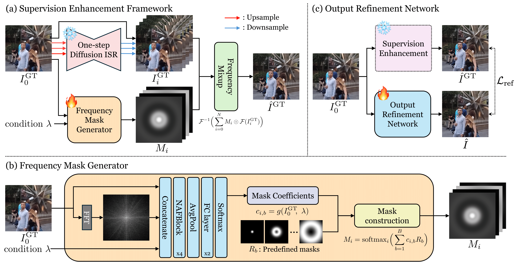

<div align="center">

<h1>Beyond the Ground Truth: Enhanced Supervision for Image Restoration</h1>

<a href="https://arxiv.org/abs/2512.03932"></a>

</div>

---

## 🎬 Overview


## 🔧 Dependencies and Installation

1. **Clone the repository**
    ```bash
    git clone https://github.com/dhryougit/Beyond-the-Ground-Truth.git
    cd Beyond-the-Ground-Truth
    ```

2. **Install dependent packages**
    ```bash
    pip install -r requirements.txt
    ```

## 📂 Data Preparation

We utilize the **[SIDD](https://abdokamel.github.io/sidd/)** and **[GoPro](https://seungjunnah.github.io/Datasets/gopro)** datasets for training. Our method adopts a 2-stage training process that leverages **super-resolved ground truths** to enhance supervision quality. We employ diffusion-based super-resolution networks ([OSEDiff](https://github.com/cswry/OSEDiff)) to generate these refined target images.

#### Step 1: Generate Super-resolved Ground Truths
To prepare the "Super-resolved GT" variants, follow this procedure:
1.  **Upscale:** Use your original Ground Truth (GT) images as input for [OSEDiff](https://github.com/cswry/OSEDiff) (or similar diffusion SR models) to generate **2x, 3x, and 4x** super-resolved versions.
2.  **Downsample:** Resize these super-resolved images back to the **original GT resolution**.

#### Step 2: Create Path List Files
Create `.txt` files listing the paths of the images. Each line should correspond to a single image path. You can use the provided `data_path_write.py` script to automate this.

**File content example:**
```text
/path/to/dataset/image_001.png
/path/to/dataset/image_002.png
```

You will need separate text files for:
* **Input (LQ)**
* **Ground Truth (GT)**
* **Super-resolved GTs** (2x, 3x, 4x variants)

---

## 🚀 Training

### 1. Train Frequency Mask Generator (Stage 1)
The first stage involves training the Conditional Frequency Mask Generator (CFMG) to enhance supervision.

Run the following command. Make sure to replace the path arguments with your generated `.txt` files.

```bash
CUDA_VISIBLE_DEVICES="0,1" accelerate launch train.py \
    --wandb_name "stage1_mask_gen" \
    --output_dir './experiments/stage1_mask_gen' \
    --wandb_project "Beyond_GT" \
    --wandb_image_log_freq 10 \
    --log_freq 5 \
    --validation_steps 15 \
    --checkpointing_steps 10 \
    --max_train_steps 100000 \
    --learning_rate 1e-4 \
    --train_batch_size 2 \
    --gradient_accumulation_steps 1 \
    --mixed_precision 'no' \
    --report_to "tensorboard" \
    --seed 123 \
    --train_dataset_txt_paths_list_lq '/path/to/sidd_input.txt','/path/to/gopro_lq.txt' \
    --train_dataset_txt_paths_list_gt '/path/to/sidd_gt.txt','/path/to/gopro_gt.txt' \
    --train_dataset_txt_paths_list_gt_refined_2x '/path/to/sidd_refined_2x.txt','/path/to/gopro_refined_2x.txt' \
    --train_dataset_txt_paths_list_gt_refined_3x '/path/to/sidd_refined_3x.txt','/path/to/gopro_refined_3x.txt' \
    --train_dataset_txt_paths_list_gt_refined_4x '/path/to/sidd_refined_4x.txt','/path/to/gopro_refined_4x.txt' \
    --test_dataset_txt_paths_list_lq '/path/to/test_lq.txt' \
    --test_dataset_txt_paths_list_gt '/path/to/test_gt.txt' \
    --dataset_prob_paths_list 1,15 \
    --lambda_l2 1 \
    --tracker_project_name "train_stage1" \
    --train_enhance
```

### 2. Train Output Refinement Network (Stage 2)
After training the mask generator, train the Output Refinement Network. You must provide the path to the trained checkpoint from Stage 1 in `--pretrained_CFMG_path`.

```bash
CUDA_VISIBLE_DEVICES="0,1" accelerate launch train.py \
    --wandb_name "stage2_refinement" \
    --output_dir './experiments/stage2_refinement' \
    --wandb_project "Beyond_GT" \
    --wandb_image_log_freq 10 \
    --log_freq 5 \
    --validation_steps 5000 \
    --checkpointing_steps 2000 \
    --max_train_steps 100000 \
    --learning_rate 1e-4 \
    --train_batch_size 4 \
    --gradient_accumulation_steps 1 \
    --mixed_precision 'no' \
    --report_to "tensorboard" \
    --seed 123 \
    --pretrained_CFMG_path '/path/to/experiments/stage1_mask_gen/checkpoints/model_nafnet_best.pkl' \
    --train_dataset_txt_paths_list_lq '/path/to/sidd_input.txt','/path/to/gopro_lq.txt' \
    --train_dataset_txt_paths_list_gt '/path/to/sidd_gt.txt','/path/to/gopro_gt.txt' \
    --train_dataset_txt_paths_list_gt_refined_2x '/path/to/sidd_refined_2x.txt','/path/to/gopro_refined_2x.txt' \
    --train_dataset_txt_paths_list_gt_refined_3x '/path/to/sidd_refined_3x.txt','/path/to/gopro_refined_3x.txt' \
    --train_dataset_txt_paths_list_gt_refined_4x '/path/to/sidd_refined_4x.txt','/path/to/gopro_refined_4x.txt' \
    --test_dataset_txt_paths_list_lq '/path/to/test_input.txt' \
    --test_dataset_txt_paths_list_gt '/path/to/test_gt.txt' \
    --dataset_prob_paths_list 1,15 \
    --lambda_l2 1 \
    --tracker_project_name "train_stage2"
```
---

## ⬇️ Pretrained Models

We provide pretrained checkpoints for both the Conditional Frequency Mask Generator (CFMG) and the Output Refinement Network (ORNet). You can download them from the links below:

| Model | Description | Link |
| :--- | :--- | :---: |
| **CFMG** | Conditional Frequency Mask Generator | [Download](https://drive.google.com/file/d/13idWjny6zW_RuAzW9lixaVhcqxmbqgjX/view?usp=sharing) |
| **ORNet** | Output Refinement Network | [Download](https://drive.google.com/file/d/1ZuM7dMbccyH1YabnfIgCHepeeFKDVJl7/view?usp=sharing) |

> Please place the downloaded models in a folder (e.g., `./checkpoints/`).

---

## 🧪 Inference & Evaluation

You can use our pretrained models for two main purposes: **generating enhanced Ground Truths** and **refining outputs** from other restoration networks.

### 1. Generate Enhanced Ground Truths (using CFMG)
Use the pretrained **CFMG** to generate enhanced GTs and refined outputs. This script requires the path list files created in the Data Preparation step.

```bash
CUDA_VISIBLE_DEVICES=0 accelerate launch enhancement.py \
    --output_dir './results/enhanced_gt' \
    --logging_dir './results/logs' \
    --report_to "tensorboard" \
    --seed 123 \
    --train_dataset_txt_paths_list_lq '/path/to/test_lq.txt' \
    --train_dataset_txt_paths_list_gt '/path/to/test_gt.txt' \
    --train_dataset_txt_paths_list_gt_refined_2x '/path/to/test_refined_2x.txt' \
    --train_dataset_txt_paths_list_gt_refined_3x '/path/to/test_refined_3x.txt' \
    --train_dataset_txt_paths_list_gt_refined_4x '/path/to/test_refined_4x.txt' \
    --dataset_prob_paths_list 1 \
    --tracker_project_name "generate_enhanced_gt" \
    --pretrained_CFMG_path './checkpoints/CFMG.pkl'
```

### 2. Refine Restoration Outputs (using ORNet)
You can apply our **ORNet** to improve the results of *any* other image restoration network. 
1.  First, restore images using your target model (e.g., FFTformer, Restormer) and save them to a specific folder.
2.  Run the script below to refine those images using ORNet.

```bash
CUDA_VISIBLE_DEVICES=0 python test_refinement.py \
    -i "/path/to/restored_images_folder" \
    -g "/path/to/ground_truth_folder" \
    --dataset_names "GoPro_Test" \
    --log_dir "./results/refinement_logs" \
    --pretrained_path './checkpoints/ORNet.pkl' \
    --batch_size 1 \
    --save_refinement_output \
    --save_logfile \
    --test_metric
```

* `-i`: Directory containing the initial restored images (input for ORNet).
* `-g`: Directory containing the Ground Truth images (for metric calculation).
* `--save_refinement_output`: Save the final refined images.

---

## 📜 Citation
If you find our work useful for your research, please consider citing:

```bibtex
@article{ryou2025beyond,
  title={Beyond the Ground Truth: Enhanced Supervision for Image Restoration},
  author={Ryou, Donghun and Ha, Inju and Chu, Sanghyeok and Han, Bohyung},
  journal={arXiv preprint arXiv:2512.03932},
  year={2025}
}
```


